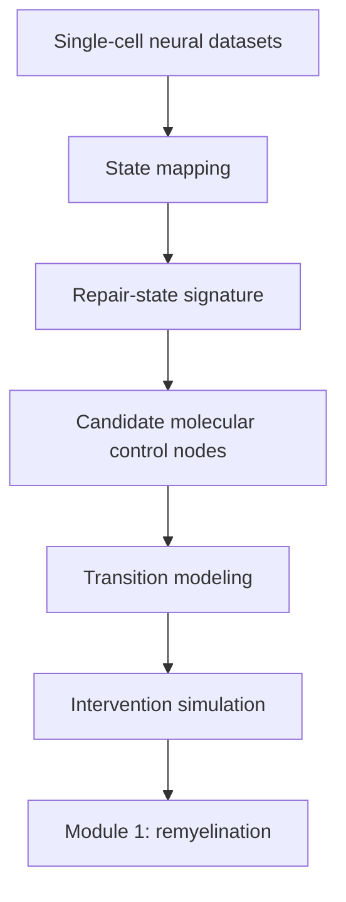

# Programmable Neurorepair

---

## Engine architecture

Programmable Neurorepair is a computational engine for mapping neural cell-state transitions and identifying molecular control points that can shift cells toward regenerative or functional states.

The project is motivated by a broader question: how can neural systems move from being highly observable to becoming more predictable, interpretable, and eventually guideable? The current proof of concept focuses on remyelination, using single-cell transcriptomic data to model how oligodendrocyte-lineage cells move between precursor-like and mature repair states.

---

## Why this matters

Modern neuroscience can measure cells, circuits, and molecular states at extraordinary resolution, but still lacks principled frameworks for understanding what actually controls transitions between neural states.

As a result, many interventions remain blunt relative to the complexity of the systems they are trying to affect. We can often describe dysfunction in great detail without understanding which molecular control points govern movement between damaged, adaptive, and repair-supporting states.

Programmable Neurorepair is an attempt to help close that gap.

---

## Current focus: oligodendrocyte repair dynamics

The first module focuses on oligodendrocyte-lineage dynamics during demyelination and remyelination.

Using single-cell transcriptomic datasets, the framework models transitions between:

- precursor-like oligodendrocyte states
- mature oligodendrocyte repair states

This allows the system to identify molecular control points associated with the probability of cells entering a remyelinating state.

---

## Repair-state signature

The current repair-state program includes genes strongly associated with mature oligodendrocyte function and remyelination:

- Mal
- Cldn11
- Plp1
- Mog
- Mobp
- Mbp
- Mag
- Cnp
- Abca2
- Tspan2
- Ptgds
- Myrf

These genes define the mature repair-state signature used by the engine to classify cellular states and model repair-associated transitions.

---

## Candidate molecular control layers

Initial analyses highlight several mechanistically distinct candidate layers associated with remyelinating states:

### Flagship repair-state lever
- **Tspan2**

### Repair architecture / support layer
- **Gjc2**
- **Fa2h**
- **Aspa**
- **Abca2**

### Signaling and control candidates
- **Ptgds**
- **Ptprd**

Together, these candidates suggest that remyelination may be decomposed into multiple functional layers rather than explained by a single marker or pathway.

---

## Current status

Early computational framework, already implemented across multiple independent datasets.

The first wedge has already produced a visible evidence layer rather than only a conceptual project description. Current outputs include repair-state structure, a curated mature repair-state signature, candidate control-layer separation, transition-oriented logic, cross-dataset directional support, and intervention-oriented prioritization.

---

## Current evidence

### Evidence artifacts

- [Dataset roles](results/dataset_roles.md)
- [Repair signature genes](results/repair_signature_genes.md)
- [Candidate control layers](results/candidate_control_layers.md)
- [Transition logic summary](results/transition_logic_summary.md)
- [Current outputs snapshot](results/current_outputs_snapshot.md)
- [Current candidate ranking (CSV)](results/current_candidate_ranking.csv)
- [Repair signature (CSV)](results/repair_signature.csv)

### Current operational status

- state-structure derivation implemented
- mature repair-state signature derived
- candidate control-layer separation implemented
- transition-oriented logic implemented
- cross-dataset directional support established
- intervention-oriented prioritization implemented

### Why this matters

Programmable Neurorepair is not only arguing that neural state transitions should be modeled differently. It already contains the first operational layers of that approach: state-structure derivation, repair-state definition, candidate control-layer separation, and transition-oriented intervention logic.

### Evidence table

| Component | Current evidence |
|---|---|
| Repair-state structure | oligodendrocyte-lineage progression modeled across datasets |
| Repair-state signature | curated mature repair-state program derived |
| Candidate prioritization | leverage / support / signaling layers identified |
| Transition logic | state-shift / repair-probability modeling implemented |
| Cross-dataset support | directional consistency across distinct biological contexts |

---

## Long-term vision

Programmable Neurorepair is designed as the first module of a broader platform for understanding and guiding neural cell-state transitions across the central nervous system.

Remyelination is the initial tractable test case, but the larger objective is to extend this framework toward additional neural systems and state dynamics, including neural adaptation, plasticity, and other forms of coordinated biological reorganization.

The long-term goal is to build computational systems capable of identifying molecular control points that govern neural plasticity, repair, and adaptation—and eventually make neural state transitions more predictable and guideable.

---

## Repository structure

- `figures/` — visual evidence layer
- `results/` — model outputs and tables
- `docs/` — project-level documentation
