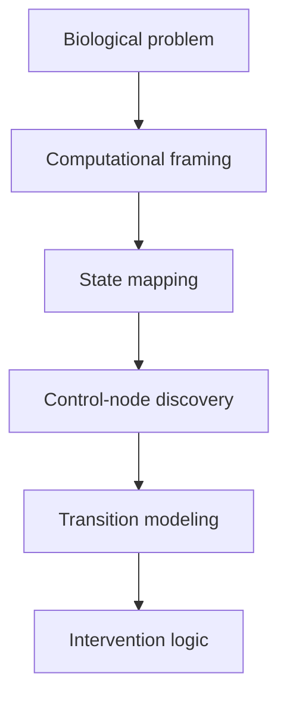

# Documentation

This folder contains the conceptual and technical documentation for Programmable Neurorepair.

Its role is to explain how the engine is structured, what biological problem it is trying to solve, and how the current remyelination module connects to a broader platform vision centered on neural cell-state transitions.

## Documentation layers

## Planned document types

### 1. Project overview

Short summaries that explain the idea, current system, and long-term platform direction.

### 2. Technical notes

Documents describing the modeling logic, dataset integration strategy, repair-state signature derivation, and candidate prioritization framework.

### 3. Module summaries

Documents describing how each module fits into the broader platform.

Current module:

- Module 1: remyelination / oligodendrocyte repair dynamics

Planned future modules:

- inflammatory-state control  
- astrocyte state dynamics  
- broader neural adaptation and repair-state modeling  

### 4. Public-facing materials

Documents intended for applications, presentations, and early project communication.

Examples:

- one-page overview  
- fellowship materials  
- project summaries  
- slide decks  

## Why this folder exists

Programmable Neurorepair is not only an analysis pipeline. It is being developed as a framework with a biological thesis, an engine structure, and a long-term platform direction. This documentation layer is meant to make that structure explicit.
