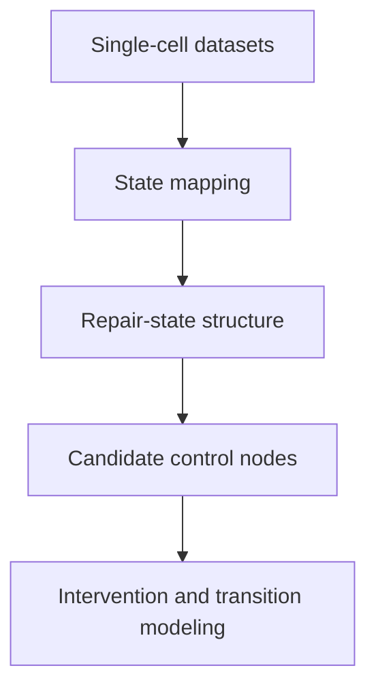

# Figures

This folder contains the visual layer of the Programmable Neurorepair engine.

The purpose of this layer is to make the logic of the framework interpretable at a glance: how neural cell states are organized, how repair-associated programs emerge, and which molecular control points appear most relevant.

## Figure logic

## Planned figure categories

### 1. State landscape figures

These figures will visualize how oligodendrocyte-lineage cells distribute across precursor-like and mature repair states under different biological conditions.

Examples:

- demyelination vs normal vs remyelination state gradients
- mature-vs-precursor enrichment patterns
- lineage-specific repair-state structure

### 2. Cross-dataset validation figures

These figures will show whether repair-associated patterns remain directionally consistent across independent datasets.

Examples:

- dataset transfer validation
- condition-level ordering of repair states
- cross-dataset candidate consistency

### 3. Candidate prioritization figures

These figures will summarize the molecular control architecture identified by the engine.

Examples:

- flagship lever candidates
- repair architecture genes
- signaling/control candidates
- intervention ranking outputs

### 4. Transition-engine figures

These figures will visualize how candidate perturbations are predicted to shift the probability of mature repair states.

Examples:

- intervention ranking
- delta-probability plots
- candidate-specific state-shift simulations

## Why this matters

The figure layer is designed to turn high-dimensional single-cell analysis into interpretable visual representations of neural state transitions and candidate intervention logic.
