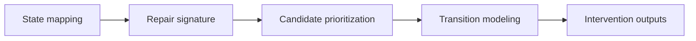

# Results

This folder contains the output layer of the Programmable Neurorepair engine.

Its purpose is to store compact, interpretable outputs generated by the framework: repair-state signatures, candidate rankings, transition-model results, and intervention-oriented summaries.

## Result architecture

## Core result types

### Repair-state signature outputs

These results define the molecular program associated with mature oligodendrocyte repair states.

Current repair-state genes include:

- Mal
- Cldn11
- Plp1
- Mog
- Mobp
- Mbp
- Mag
- Cnp
- Abca2
- Tspan2
- Ptgds
- Myrf

### Candidate control-node outputs

These results summarize the molecular candidates most strongly associated with repair-state transitions.

| Layer | Examples |
|---|---|
| Flagship repair-state lever | Tspan2 |
| Repair architecture / support | Gjc2, Fa2h, Aspa, Abca2 |
| Signaling / control | Ptgds, Ptprd |

### Transition-model outputs

These results summarize how candidate perturbations are predicted to shift the probability of mature repair states.

Typical outputs include:

- logistic coefficients
- candidate transition leverage
- intervention ranking
- simulated state-shift effects

## Current status

The repository is an early public-facing version of the project. As the engine develops, selected outputs will be added here in a more formal and reproducible format.

## Long-term role of this folder

This folder is intended to become the compact evidence layer of the project: the place where the engine’s most important conclusions can be read quickly without needing to inspect the full analysis workflow.
